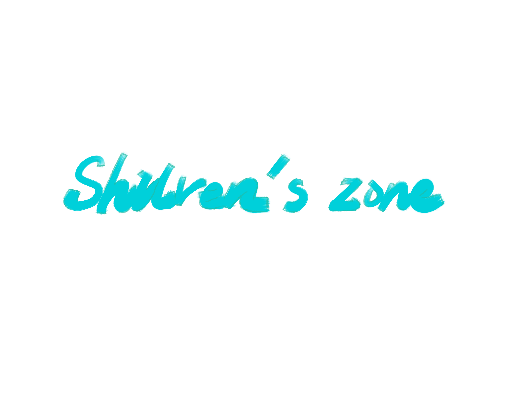

# Shilren.github.io

整个项目的基调是作品集、博客或者linkedin个人主页。
第一步制作原型图，预想制作一个首页，包括菜单（联系方式 其他社交账号 ）
一个很大的按钮幕布，点击之后上移，下面是内容，先是分门别类的几个小版块（包括个人涉及的领域，和自己的所思所想，个人学习笔记），点击相应板块就能跳转到相应的位置。【财会CPA】【生活思考】【运营笔记】【数据分析】【ps视频剪辑绘画】【产品经理】
第二个网页是文章页面，里面的内容包括
需要准备的是一个icon

准备一个背景图
