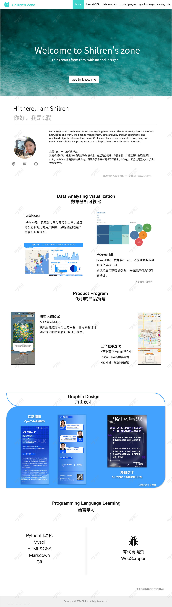

# Shilren.github.io
## 个人网站设计基调&原型图
- **项目的基调：**
作品集、博客或者linkedin个人主页。
- **制作原型图：**
预想制作一个首页，包括导航页，【财会CPA】【产品运营笔记】【数据分析】【ps视频剪辑绘画】【语言学习】
- **动作：**
点击相应板块就能跳转到相应的位置。
- **缺点：**
技术和时间有限导致过于简陋，信息展板参考企业官网。
- **资料：**  
    *需要准备的是一个icon*  
      
    *准备一个背景图*
    
---
## 原型图:

